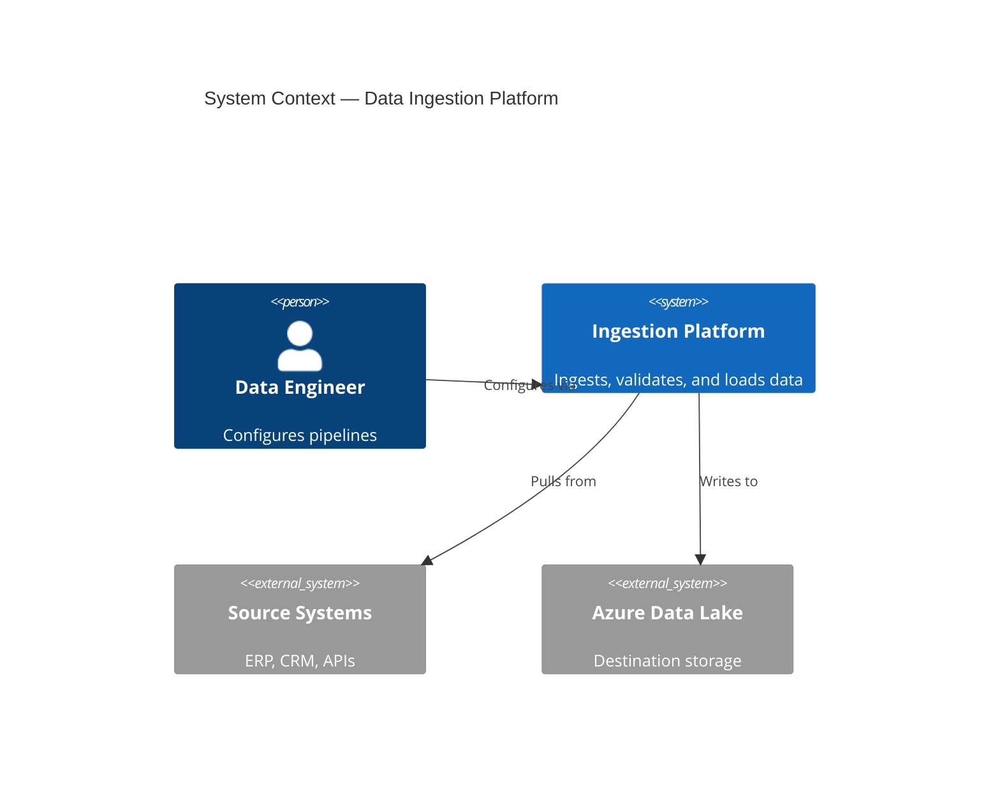
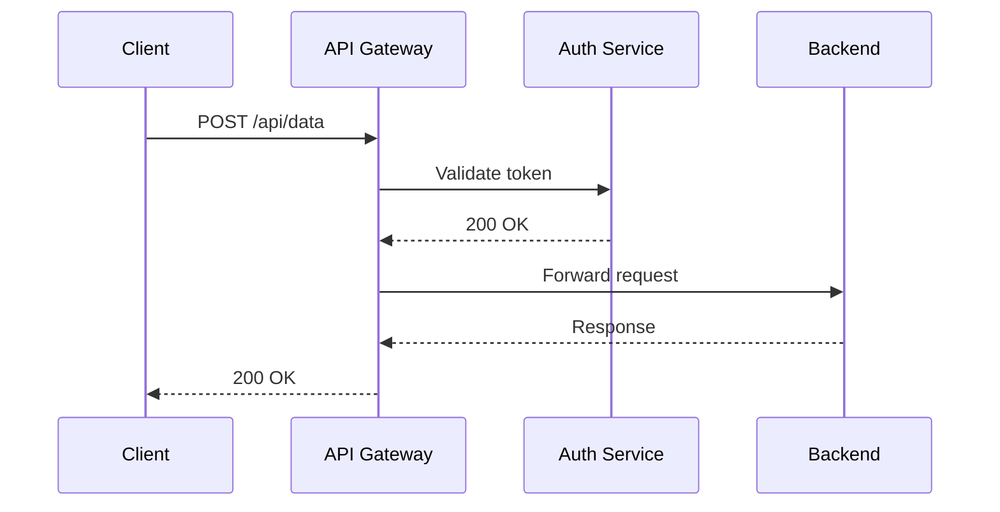
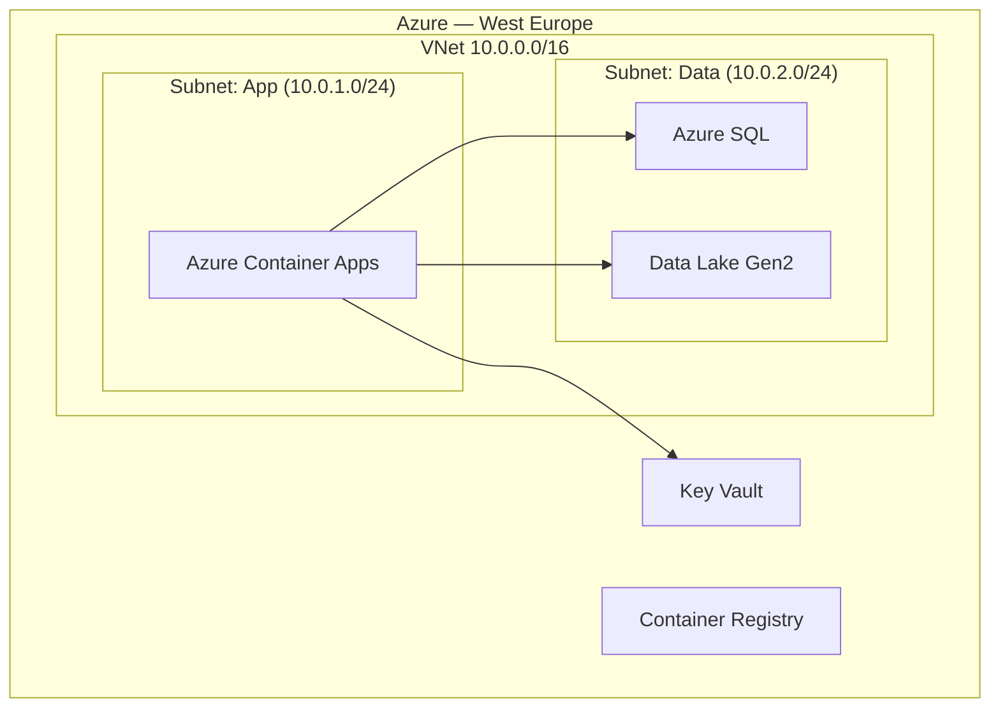

## Usage

Invoke with `/arch-diagram` then provide:
- What to diagram (system, service, data flow, deployment topology, etc.)
- Diagram type (see supported types below)
- Level of detail: `high-level` (boxes and arrows) or `detailed` (includes tech stack, protocols, ports)

## Supported Diagram Types

| Type | C4 Level | Use for |
|---|---|---|
| `context` | L1 | Show the system and its external users/dependencies |
| `container` | L2 | Show the major components and how they communicate |
| `component` | L3 | Zoom into one container — internal modules and connections |
| `sequence` | N/A | Time-ordered interactions between services for one flow |
| `data-flow` | N/A | How data moves through pipelines, transformations, and stores |
| `deployment` | N/A | Azure resources, VNets, subnets, and connectivity |

## Output

**Always produce:** A Mermaid code block (renders natively in GitHub, Confluence, and VS Code).

**When requested:** An ASCII fallback for environments that don't render Mermaid.

### Context Diagram (Mermaid C4)

### Sequence Diagram

### Deployment (Azure)

## Steps

1. Identify diagram type and level of detail from the input
2. Identify all actors, systems, or components to include
3. Identify the relationships / data flows / call sequences between them
4. Generate the Mermaid diagram
5. Add a brief plain-English description above the diagram (2-3 sentences) for context
6. Offer to adjust level of detail or add/remove components

## Rules

- Group related resources in `subgraph` blocks for readability
- Use consistent directional flow: left-to-right for data flows, top-to-bottom for deployment
- Do not include IP addresses or secrets in diagrams
- Keep each diagram to one concern — don't mix L1 and L3 detail
